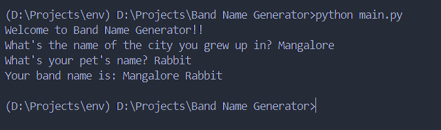

# **Band Name Generator Project**

**Description:**
    - A simple python project that generates band name by combining user inputs and returning it as a result.
    - Uses variables, input function, print function, string datatype and method.

**How To Run:**

```bash
    python main.py
```

**Output ScreenShot**

- 

