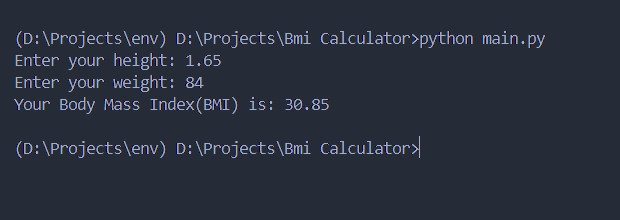

# **BMI Calculator Project**

**Description:**
    - A simple python project that calculates the body mass index based on users height and weights and returns value as a result.
    - Uses variables, input function, print function, typecasting.

**How To Run:**

```bash
    python main.py
```

**Output ScreenShot**

- 

